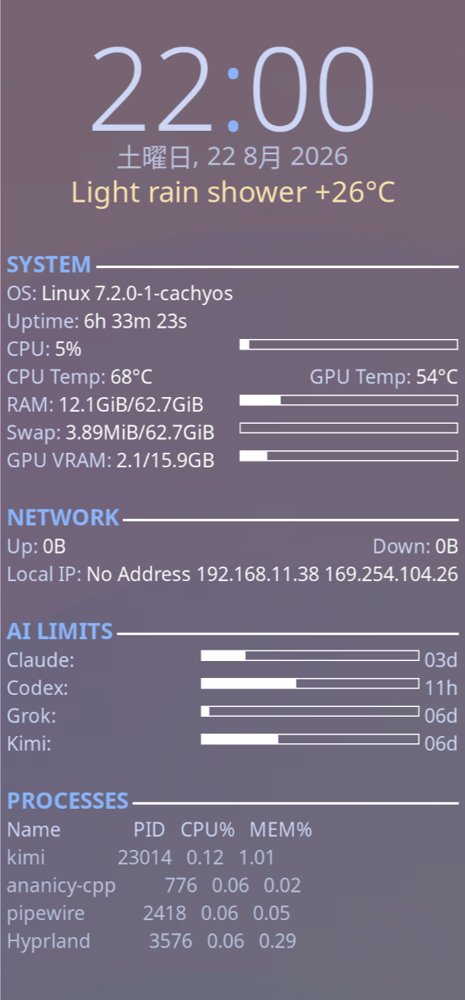

# conky-ai-quota

A Conky desktop widget with a twist: alongside the usual clock / weather /
system stats, it shows **weekly usage-quota bars for AI coding services** —
Claude (Claude Code), Codex (OpenAI), Grok (xAI), Muse Code (Meta) and MiMo
(Xiaomi Token Plan) — with time-to-reset next to each bar.

Two config variants are included:

- `conky/conky.conf` — classic X11 window (works on KDE Plasma and other X11/XWayland desktops)
- `conky/conky-hyprland.conf` — native **Wayland layer-shell background widget** for Hyprland (no window, sits behind your apps like a proper desktop widget), driven by `conky/start-conky.sh` which picks the right config based on `XDG_CURRENT_DESKTOP`



## Layout of the AI LIMITS section

```
AI LIMITS ─────────────────────────
Claude:           06d03h  ▓▓░░░░░░░
Codex gand:       01d05h  ▓▓▓▓▓▓▓▓▓
Codex gmail:      01d05h  ▓▓▓▓▓▓▓▓▓
Codex personal:   03d07h  ▓░░░░░░░░
Grok:                11h  ▓▓▓▓▓▓▓▓▓
Muse:             03d15h  ▓▓▓▓░░░░░
MiMo:             09d06h  ▓▓░░░░░░░
```

Each bar is weekly-plan utilization (Grok: billing period, MiMo: monthly plan), the text is time
until the window resets. The time sits in a fixed-width monospace column in
front of the bar, so every bar ends flush right, lined up with the SYSTEM bars.

| text | meaning |
| --- | --- |
| `06d03h`, `11h`, `42m` | time to reset |
| gray + `*` | stale: the last fetch failed or is overdue |
| `stale` | the reset has passed and no live number replaced it (bar shows 0) |
| `auth!` / `error` | no data: login missing or rejected / other failure |
| red | the weekly window, or the short burst window, is at 95% or more |

## How it polls

Each row makes four calls. `${texeci 60 <cmd> fetch}` runs in its own
thread and does the network work (at most once per 240 s per cache — Muse
every 30 min, MiMo every 15 min — with the same back-off after an error). `color`, `days` and `percent` only read the
cache, so a slow or hanging provider can never freeze the widget. Run
`<cmd> status` in a terminal for the full cached state, including the last
error; `status` and `remaining` fetch first when the cache is due.

## Several Codex accounts on one desktop

`codex-quota` takes an optional profile before the mode, and each profile maps
to its own `CODEX_HOME`:

| profile | `CODEX_HOME` |
| --- | --- |
| `default` (or omitted) | `~/.codex` |
| `<name>` | `~/.codex-<name>` |

So `codex-quota gmail percent` reads `~/.codex-gmail/auth.json`. Log each
account into its own home once — `CODEX_HOME=~/.codex-gmail codex login` — and
give it a row:

```
${color #cdd6f4}Codex gmail:$color${texeci 60 codex-quota gmail fetch}${goto 130}${execpi 60 codex-quota gmail color}${font monospace:size=11}${execi 60 codex-quota gmail days}$font${alignr}${execibar 60 8,180 codex-quota gmail percent}$color
```

This works for two workspaces of a *single* login too (a business seat and a
personal plan on the same email): the usage endpoint scopes to the workspace the
access token was minted for, so each one needs its own home and its own
`codex login`.

The `${execpi ... color}` call turns the bar **red** when the short (5h) burst
window is at 95% or more. The weekly number can look comfortable while that
burst limit is what is actually blocking a session, so it is worth seeing.
Caches are per profile: `~/.cache/codex-quota-<profile>.json`.

## Install

```bash
cp bin/*-quota bin/ai_quota_common.py ~/.local/bin/   # the pollers + their shared module
cp conky/conky.conf ~/.config/conky/  # and/or conky-hyprland.conf
cp conky/start-conky.sh ~/.config/conky/
cp conky/conky.desktop.example ~/.config/autostart/conky.desktop  # then fix the Exec path inside
```

Requirements:

- `conky` (1.21+; the Hyprland variant needs a build with Wayland support — check `conky --version`)
- `python3` (standard library only)
- The AI CLI tools installed **and logged in** — the pollers reuse their local credentials:
  - `claude` → `~/.claude/.credentials.json`
  - `codex` → `~/.codex/auth.json` (or `~/.codex-<profile>/auth.json`, see below)
  - `grok` → `~/.grok/auth.json`
  - `muse` → `~/.config/muse/auth.json` (the key `muse login` stores)
  - MiMo → a Xiaomi account file you create yourself, see below

No API keys to configure, no tokens in the repo: the scripts read the CLI's
own credential files at runtime and cache responses in `~/.cache/<name>-quota.json`.
Caches only ever hold numbers, timestamps and an error type — never response
bodies or tokens.

## Token refresh behavior

All three pollers refresh an expired access token with the CLI's own OAuth
client and write it back atomically, keeping every other field in the file.
A lock serializes the pollers, and the file is re-read before writing so a
refresh the CLI made in the meantime wins. If a refresh is rejected the row
shows `auth!`: log in again with the CLI (for a Codex profile, in its home:
`CODEX_HOME=~/.codex-gmail codex login`).

## Muse: one tiny prompt per poll

Meta has no usage endpoint for Muse Code: the weekly and 5-hour numbers only
arrive as a `response.subscription_usage` event on a model response. So each
`muse-quota` fetch sends a one-line prompt (16 output tokens, minimal
reasoning) and reads that event — about 48 small calls a day, against your
own weekly allowance.

## MiMo: the console session

Xiaomi serves Token Plan usage only from the platform console, behind a
24-hour session cookie; the `tp-` API key cannot read it. `mimo-quota` mints
that cookie the way the web console does (`serviceLogin` → `/sts`) from your
Xiaomi account login, which you save once:

```bash
mkdir -p ~/.config/mimo-quota
install -m 600 /dev/null ~/.config/mimo-quota/account.json
$EDITOR ~/.config/mimo-quota/account.json   # {"userId": "...", "passToken": "..."}
```

Take both values from the `account.xiaomi.com` cookies in a browser where you
are logged in to platform.xiaomimimo.com (DevTools → Application → Cookies).
The account cookies are only ever sent to `*.xiaomi.com`. Until the file
exists, or when Xiaomi rejects the login, the row shows `auth!`.

## Tests

```bash
python3 -m unittest discover -s tests
```

## Machine-specific bits to adjust

The configs are written for an AMD desktop; tweak these for your machine:

- **Temperatures:** `${hwmon k10temp temp 1}` (AMD CPU) / `${hwmon amdgpu temp 1}` (AMD GPU). On Intel use `coretemp`; on a ThinkPad `${hwmon thinkpad fan 1}` gives fan RPM. See `ls /sys/class/hwmon/hwmon*/name`.
- **GPU VRAM:** reads `/sys/class/drm/card1/device/mem_info_vram_*` — change `card1` to your GPU, or delete the line (e.g. iGPU-only laptops).
- **Network interfaces:** `${addr enp3s0}` etc. — replace with your interface names (`ip -o link`).
- **Weather:** `wttr.in` with no location argument (IP geolocation). Add your city if you prefer: `wttr.in/Tokyo?format=%C+%t`.
- Make sure `~/.local/bin` is in your session `PATH` (the conky configs call the pollers by bare name).

## Hyprland notes

- The Wayland variant uses conky's layer-shell output (`out_to_wayland`, `own_window_type = 'desktop'`), so it renders on the background layer instead of tiling as a window.
- `start-conky.sh` switches configs per session; point your autostart entry at it (see `conky.desktop.example`).
- Conky quirk: `${execibar}` wants bar dimensions **before** the command (`${execibar 60 8,180 cmd}`), otherwise the numbers are passed to the script as arguments.

## License

MIT — see [LICENSE](LICENSE).
